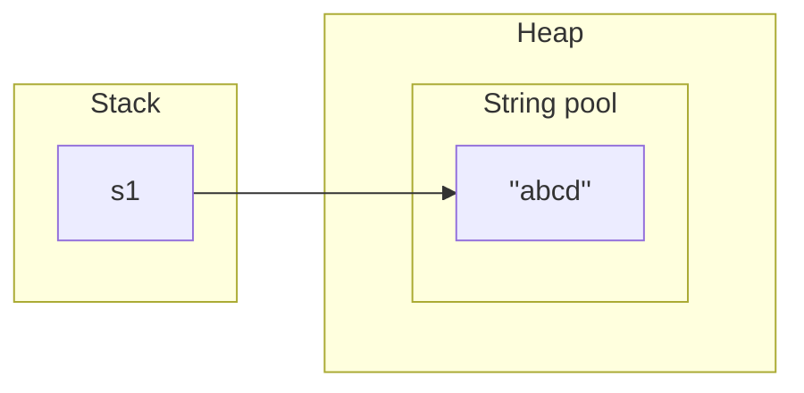
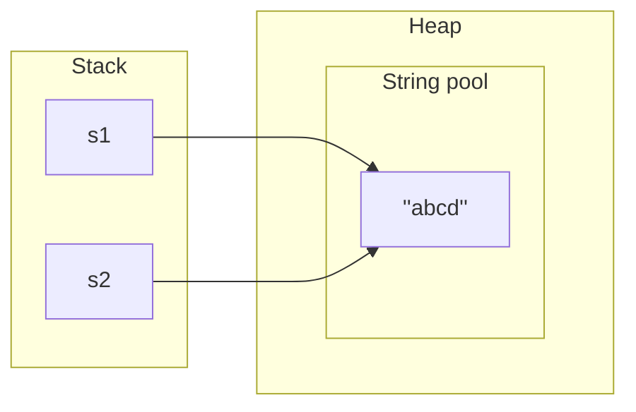
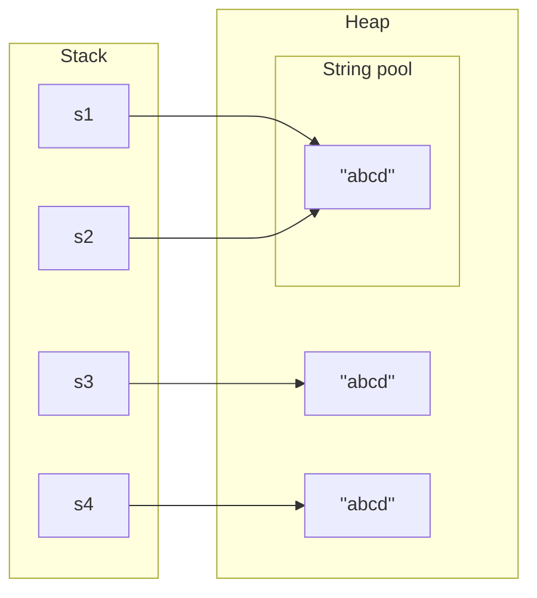
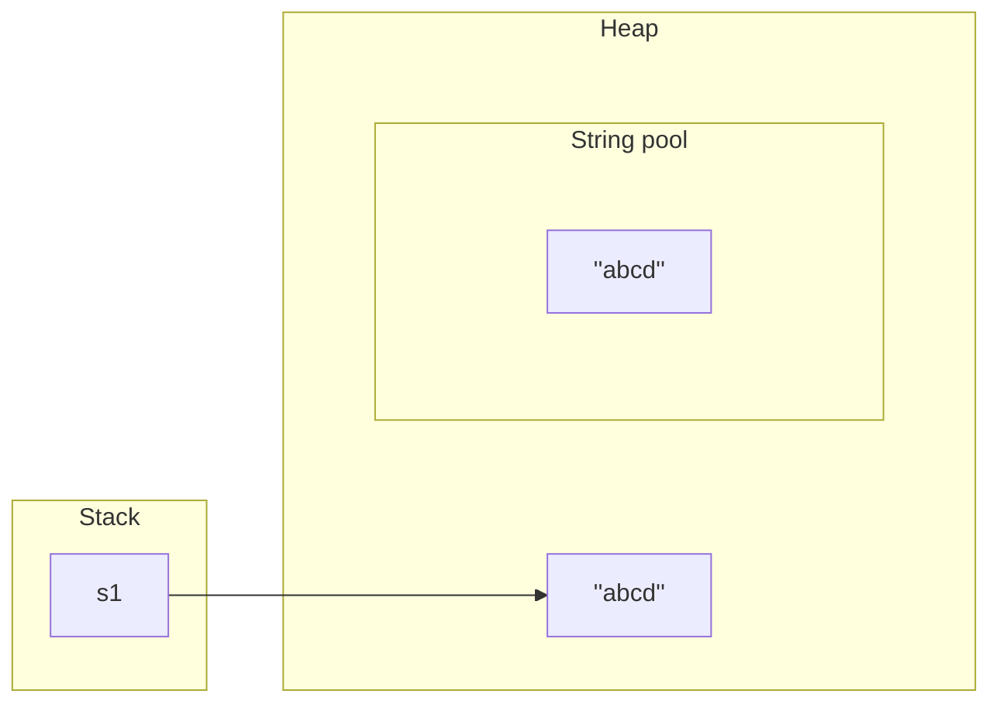
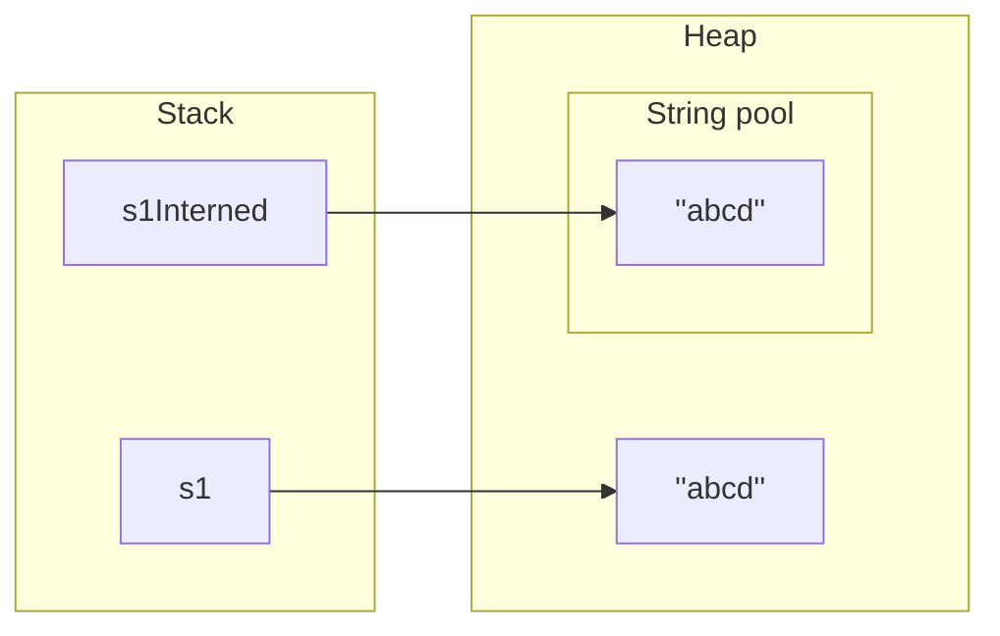

In this post you will learn about `String constant pool` (or `String pool` for short) in **Java**.

Knowing about `String pool` will deepen your knowledge of **Java** internals, which is always a plus for a Software Developer.

Let's start with the basics.

---

## String

In Java, the smallest unit of textual data is represented as `char` (character), which is UTF-16 encoded (more on character encoding [here]() ).

To create of collection of characters, we could use a **character array** like this:

```java
char[] someText = {'a', 'b', 'c', 'd'};
```

But there is a simpler way to represent a sequence of characters in **Java**:

```java
String someText = "abcd";
```

> `"abcd"` in code above is called `String literal`.
{: .prompt-info }

In the example above, string `someText` represents a sequence of characters, but it’s not a primitive type. When you create a string in **Java**, you are creating an object of the **String** class.

It's a special class in **Java** that has additional features when compared to other classes:
- it's **immutable**, meaning once created it cannot be changed (more on why is so later, check [here](#string-immutability))
- it's the only class where operator overloading is supported in **Java**. We can concatenate strings using the `+` operator. For example `"a"+"b"="ab"`.
- it's `final` by definition, so no other class can override the methods of the `String` class. This guarantees that the behavior of the `String` objects is the same everywhere.

Not only does it give you a more concise representation of the characters collection, but it also has a lot of helper methods like `startsWith`, `endsWith`, `compareTo`, `compareToIgnoreCase`, `replace`, `replaceAll`...

> Note on `Compact Strings`
> 
> We already know that `char` is `UTF-16` encoded, which means that it takes 2 bytes per character. But not all characters need 2 bytes (ASCII characters requires just 1 byte of memory).
> 
> That is why starting from Java 9 there is a new representation of a String, called `Compact String`. Instead of char[], it will choose between char[] and byte[] depending on the content that is stored.
> 
> This greatly reduces the size of the memory used for strings if they are predominantly made up of ASCII characters, and improves Garbage Collector performance.
{: .prompt-info }

---

## Comparing strings

Let's take a look at the following code:

```java
String s1 = "abcd";
String s2 = "abcd";

boolean areStringsTheSame = s1 == s2;
```

What do you expect to see as a value of `areStringsTheSame` variable? If you guessed `true` you would be right.

And what about the following code:

```java
String s1 = new String("abcd");
String s2 = new String("abcd");

boolean areStringsTheSame = s1 == s2;
```

Now, the value of `areStringsTheSame` is `false`!

What is going on here 🤔?

> String comparison should be done with `equals()` or `equalsIgnoreCase()` methods, since they will compare the content itself, not the reference to the objects like `==` operator. We are doing it here to demonstrate how strings are internally stored by Java in memory.
{: .prompt-warning }


---

## String pool

Let's take a look at what happens in the example of declaring a string.

```java
String s1 = "abcd";
```

As for any other class, **Java** will create an object instance of the `String` class.

Now, `s1` is a reference to that object, and it's placed on the stack (as is expected). 

**String literal** (value) on the other hand is put in a heap, but in a special place called `String pool`.

The following diagram explains the memory allocation for the above declaration:



> `String pool` is not local for the thread. Each string is available to all threads for our application.
{: .prompt-info }

---

## String Interning

Why is **Java** using `String pool` in the first place?

It takes advantage of the immutability of strings to optimize memory allocation in a heap by storing only one instance of `string literal` for all appearances in the program.

This process of maintaining `String pool` is called `Interning`.

Each time a String variable is created and assigned with `string literal`, Java compiler will search the `String pool` for a string with equal value. If found, it will be reused by passing a reference to this object instance in `String pool`. Otherwise, it will be created just as we described earlier. In this way, memory allocation is reduced.

Let's expand on the example with the following code:

```java
String s1 = "abcd";
String s2 = "abcd";
```

On line **2**, the **Java** compiler will find `"abcd"` **string literal** in a `String pool` and provide reference to `s2`.

Here is a diagram that presents this memory allocation:



---

## Using String Constructor

Is there a way to make a string on the heap outside `String pool`?

Yes, using `String constructor`.

> When we create a String via the `new` operator, the Java compiler will create a new object and store it in the heap space reserved for the JVM.
{: .prompt-warning }

If we expand once more on our example:

```java
String s1 = "abcd";
String s2 = "abcd";
String s3 = new String("abcd");
String s4 = new String("abcd");
```

Its memory allocation would be the following:




---

## Manual Interning

There is a way to manually `intern` a string in the `String pool` by using `intern()` method on the string object itself.

```java
String s1 = new String("abcd");
String s1Interned = s1.intern();
```

After line `1`:



Note that on line `1` the `string literal` itself must be interned.

After line `2`:




> Beware that call to `String.intern()` manually is time-consuming.
{: .prompt-danger }

> Note on `String pool` for older **Java** versions
>
> It is true that `String pool` is allocated on the `heap` memory starting from Java 7.
> 
> Before that, it was placed in PermGen, which has a fixed size. Since it has a fixed size, we could get OutOfMemory exception if we were to intern too many Strings.
> 
> Since Java 7, the `String pool` is stored in the heap, which is garbage collected by the JVM. As it is part of the heap, Garbage Collector will clear unused strings and it reduces the risk of getting OutOfMemory exception. Furthermore, this memory can be expanded if we anticipate heavy use of strings in our application.
{: .prompt-warning }

---

## String immutability

Now that we covered the inner mechanisms of `String pool` we can better understand decision for making `String` class immutable. Here are the main reasons for such a decision:

- `String pool` would not be possible if the string was not immutable. We already mentioned that **Java** is optimizing memory use by supplying the same reference to all variables that use that particular string. In case the string is mutable, it would mean that value for all variables in the program would change if they were all using the same instance.
- Security is one of the reasons why it's good that string is immutable. Any credentials like username/password for accessing DBs, or other configuration parameters should be unchanged once provided to the application.
- Multithreading is easy with strings, since they are immutable, as we don't have to worry about sharing strings between multiple threads. Strings are thread-safe by design.
- One advantage of being immutable is that calculation of a `hashcode` is done only once - at the time of the creation of a string. Because of that, strings are great for use in `HashMap` as a `key` and they are the most used `key` in `HashMap` actually.

---

## String concatenation

**Java** is doing automatic `intern` of `string literals` and their concatenations, but not a concatenation of `string literal` with a `String object`. Let's see this example:

```java
String s1 = "ab" + "cd"; // interned
String s2 = "ab"; // interned
String s3 = s2 + "cd"; // not interned
s3 = s3.intern(); // explicit intern
```

## Performance of string concatenation

When using a concatenation of strings in **Java**, with each concatenation, the following steps are made:

- Contents of both strings are **copied**
- New `StringBuilder` object is created and appended with both strings
- The string is returned via `toString()` method of the `StringBuilder` object

Example:

```java
String s = "";
s += "a";
s += "b";
s += "c";
s += "d";
```

In this example, all mentioned steps are performed `4` times for each concatenation.

Time complexity is O(n^2) because we need to copy the previously created string in each iteration. Also, it's space demanding as well, since a new instance of `StringBuilder` class is created for each concatenation.

Instead of using `+` operator, it's recommended to use `StringBuilder`. It's roughly **300 times faster** than using `+` operator.

This does not mean that you need to use `StringBuilder` all the time. It's ok to use `+` operator, but if you encounter heavy text processing tasks, you could have a significant performance boost if you utilize `StringBuilder` instead.

---

## Other **pools**?

In Java there is also `Integer constant pool`, which behaves in a same way as a `String pool`, but with a limitation.

As per **Java** [documentation](https://docs.oracle.com/javase/7/docs/api/java/lang/Integer.html#valueOf%28int%29) it says:

> This method will always cache values in the range -128 to 127, inclusive, and may cache other values outside of this range

```java
Integer i1 = 10;
Integer i2 = 10;

// will return true
System.out.println(i1 == i2);

Integer i3 = 410;
Integer i4 = 410;

// should return false
System.out.println(i3 == i4);
```

As `Integer` is object, it should be compared using `equals()` and not `==` operator. The other way is to unbox it to `int` primitive.

---

## What about other programming languages?

As you would expect, not only **Java** uses `String pool`, it can be found in other programming languages such as **Python**, **Ruby**, **C#**, **Javascript**...

They have implementations of their own, but actually, the concept is the same.
